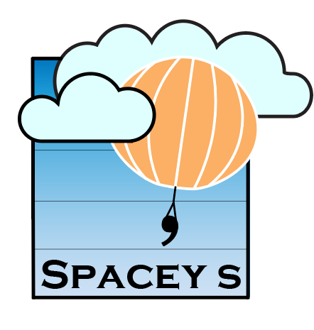

# 👋 Hi, my name is Ravil

## Computer Science Student at UBC
I'm a dedicated and driven computer science student at the University of British Columbia, currently in my final year. I'm interested in AI, data analysis, and UI/UX design, crafting user-centric solutions with a focus on innovation and value. I have practical experience in data analysis, UI/UX design, and web development. I'm eager to expand my knowledge and skills in AI, particularly deep learning, striving to enhance my expertise. 

I'm currently working on a project called **Spacey's (Stratospheric Polarization Analysis for Calculating Electromagnetic Yaw)**, as part of the CAN-SBX 2023-2024/ Canadian Stratospheric Balloon Experiment Design Challenge from UBC Okanagan.

- 👀 I’m interested in deep learning, data analysis, and UI/ UX design. 
- 🌱 I’m currently learning computer vision and microcontroller programming (particularly utilizing Thonny and Raspberry Pi Pico).
- ⚡ Fun fact: I'm passionate about drawing, both in traditional (particularly with charcoal) and digital mediums. My keen eye for design has been a defining trait since childhood. I'm proficient in Adobe Photoshop, showcasing my dedication and skill in image manipulation and graphic design.

## Projects

(https://spaceys.blog/): Spacey's is one of the official teams for the CAN-SBX 2023-2024/ Canadian Stratospheric Balloon Experiment Design Challenge from UBC Okanagan. I'm designing the software architecture for the microcontroller (Raspberry Pi Pico) that will be inside the payload of the stratospheric balloon, utilizing Python.
  
## Skills

<!-- Programming Languages:-->

<!-- Technologies/ Frameworks:-->

<!-- Tools:-->

## GitHub Stats

## Get in Touch

Feel free to explore my repositories and reach out if you have any questions or suggestions. Let's connect and collaborate! 😊

<!---
R4VILKHGB/R4VILKHGB is a ✨ special ✨ repository because its `README.md` (this file) appears on your GitHub profile.
You can click the Preview link to take a look at your changes.

-- Website: [Your Personal Website URL]

## Badges

--->
